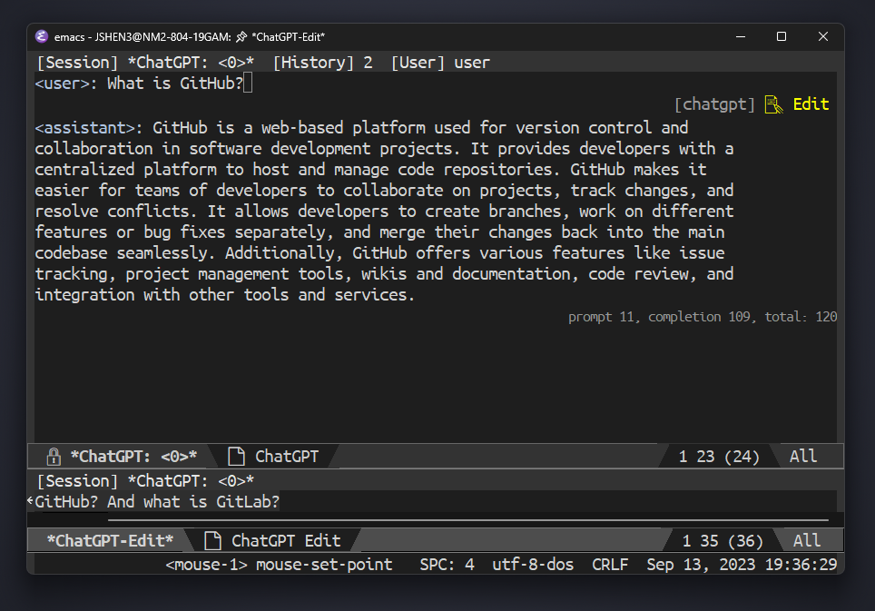

[](https://www.gnu.org/licenses/gpl-3.0)
[](https://jcs-emacs.github.io/jcs-elpa/#/chatgpt-sideline)

# chatgpt-sideline
> Sideline support for chatgpt

[](https://github.com/emacs-openai/chatgpt-sideline/actions/workflows/test.yml)

This Emacs package enhances the experience of another Emacs package, [chatgpt][].

<p align="center">

</p>

## 🏆 Features

- Edit history
- Copy text

## 💾 Installation

#### package.el

This package is available from [JCS-ELPA](https://jcs-emacs.github.io/jcs-elpa/).
Install from these repositories then you should be good to go!

Normally, you don't need to add `(require 'chatgpt-sideline)` to your
configuration since most `chatgpt-sideline` commands are autoload and can be
called without loading the module!

#### use-package

If you are using [use-package](https://www.emacswiki.org/emacs/UsePackage),
add the following to your `init.el` file:

```elisp
(use-package chatgpt-sideline :ensure t)
```

or with `straight.el`:

```elisp
(use-package chatgpt-sideline
  :straight (chatgpt-sideline :type git :host github :repo "emacs-openai/chatgpt-sideline"))
```

#### Manual installation

Copy all `.el` files in this repository to `~/.emacs.d/lisp` and add the following:

```elisp
(add-to-list 'load-path "~/.emacs.d/lisp/")
(require 'chatgpt-sideline)
```

## Quickstart

```elisp
(use-package chatgpt-sideline
  :hook (after-init . sideline-mode)
  :init
  (setq sideline-backends-right '(chatgpt-sideline)))
```

## Contribute

[](http://makeapullrequest.com)
[](https://github.com/bbatsov/emacs-lisp-style-guide)
[](https://www.paypal.me/jcs090218)
[](https://www.patreon.com/jcs090218)

If you would like to contribute to this project, you may either
clone and make pull requests to this repository. Or you can
clone the project and establish your own branch of this tool.
Any methods are welcome!


[chatgpt]: https://github.com/emacs-openai/chatgpt
